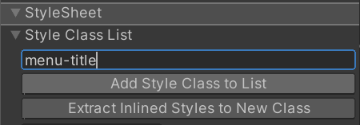

## USS selectors

A **Unity Style Sheet (USS)** is a text file recognized as an asset that supports style rules. The USS text file must have the **`.uss`** extension.

Selectors decide which elements that USS rules affect.

USS supports a set of simple selectors that are analogous, but not identical, to simple selectors in CSS. A simple selector matches elements by element type, USS class, element name, and wildcard.

You can combine simple selectors into complex selectors, or append pseudo-classes to them to target elements in specific states. USS supports descendant, child, and multiple complex selectors.

### Syntax
```
selector {
  property1: value;
  property2: value;
}
```

### Create USS selectors
You can create any new USS selectors in the **StyleSheets window**. You can also create a new class selector in the StyleSheets section in the **Inspector window**.

- To create a new selector in the StyleSheets window:
  1. In the StyleSheets window, click in the **Add new selector…** field. This opens a USS selector syntax reference window on top of the Viewport
  2. Enter the selector with the correct syntax. For example, a class selector should start with **`.`**.
  3. Press the Enter key.
  4. In the StyleSheets window, select the newly-created selector.
  5. In the selector’s Inspector window, set the desired styles for the selector.
  
- To create a new class selector in an element’s Inspector window:
  1. In the Hierarchy window, select the element.
  2. In the Inspector window, enter the class selector in the **Style Class List** text field.
  3. Select **Add Style Class to List**. A yellow-style class label appears in **Style Class List**.
  
### Set inline styles to elements
You can set inline styles to elements in the Inlined Styles section in the element’s Inspector window.
 
 
Style fields that appear **bold** with a solid line on the left of the field label represent style properties that are already set or overridden. It’s important to keep track of these **overridden** style properties, as they always override the same property coming from a StyleSheet or from a C# default. To unset or remove the **override** for a style property, right-click on the style field and select **Unset**.

> **Note**: You can’t use inline style to style **pseudo-classes** or **read-only elements**.


### Manage a style sheet
To add a style sheet, use the **`+`** dropdown menu and select one of the following options:

- **Create New USS**: This opens a Save File Dialog to create a new style sheet in your project.
- **Add Existing USS**: This opens the Open File Dialog to add an existing style sheet to the UI Document.

- To remove a style sheet from the active UI Document, right-click on the style sheet and select Remove USS.

- To make a style sheet active, right-click on a style sheet and select Set as Active USS. An Active StyleSheet appears bold.


### Match USS style class to elements
You can match USS classes to elements.

To match USS style class to elements, do any of the following:

- Drag a style class label onto the element in either the Hierarchy or the Canvas.
- Enter the name of the selector into the **StyleSheet > Style Class List** field in the element’s Inspector window and then select **Add Style Class to List**:

  

#### Style matching with rules
When you define a style sheet, you can apply it to a **visual tree**
. Selectors match against elements to resolve which properties apply from the USS file. If a selector matches an element, the style declarations apply to the element.

**USS** supports several types of simple and complex selectors that match elements based on different criteria, such as the following:

- Element **C#** type name
- An assigned **name** property
- A list of **USS** classes
- The element’s position in the **visual tree** and its relationship to other elements


**USS** also supports pseudo classes that you can use with selectors to target elements that are in a specific state or select the **`:root`** element.

### Match USS style name selector to elements

If there is a existed name selector in USS stylesheet match the name of the element, it automatically change the style. 

Or you can add new name selector match the name of the element you want in the StyleSheets window, after adding to the list below, the style change immediately.

### Manipulate USS selectors
To copy, paste, duplicate, rename, or delete one or more USS selectors:

1. In the StyleSheets window, select the group.
2. Right-click the group and select the desired action.

> **Tip**: You can copy and paste a USS selector between the UI Builder’s StyleSheets window and a text editor.

| Selector type | Syntax | Matches |
| --- | --- | --- |
| Type selector | **`Type {...}`** | Elements of a specific C# or visual element type. |
| Class selector | **`.class {...}`** | Elements with an assigned USS class. |
| Name selector | **`#name {..}`** | Elements with an assigned name attribute. |
| Universal selector | **`* {...}`** | Any elements. |

| Selector type | Syntax | Matches |
| --- | --- | --- |
| Descendant selector | **`selector1 selector2 {...}`** | Elements that are the descendant of another element in the visual tree. |
| Child selector | **`selector1 > selector2 {...}`** | Elements that are the children of another element in the visual tree. |
| Multiple selector | **`selector1selector2 {...}`** | Elements that match all the simple selectors. |

| Topic | Description |
| --- | --- |
| Type selectors | Match elements based on their element types. |
| Name selectors | Match elements based on the name of an element. |
| Class selectors | Match elements that have specific USS classes assigned. |
| Universal selectors | Match any element. |
| Descendant selectors | Match elements that are descendants of another element in the visual tree. |
| Child selectors | Match elements that are children of another element in the visual tree. |
| Multiple selectors | Select elements that match all the simple selectors. |
| Selectors list | Create a comma-separated list of selectors that share the same style rule. |
| Pseudo-classes | Use pseudo-classes with selectors to target elements that are in a specific state. |
| Selector precedence | Understand USS precedence when multiple USS rules target the same elements. |


> If an element matches more than one selector, USS applies the styles from whichever selector **takes precedence**. Note: All selectors are **case-sensitive**.

### Connect styles to elements
You can connect styles to elements by the following methods:

- In **UI Builder**, style an element with **inline styles** or **USS selectors**. 
- In **UXML**, style an element with inline styles or attach a style sheet with selectors matching this element. 
- In a **C#** script, set styles directly to the **style** properties or add a **USS** style sheet to the styleSheet property with selectors matching an element. 


### ref 

https://docs.unity3d.com/Manual/UIE-USS-Selectors.html

