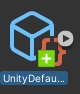
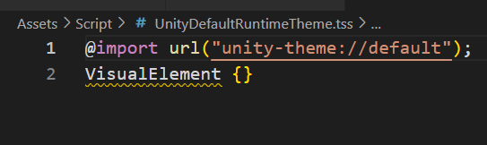

## Theme Style Sheet (TSS)

**Theme Style Sheet (TSS)** files are regular USS files. \
UI Toolkit treats TSS as a **distinct asset type** and uses it for **management purposes**.

Regular **USS syntax** and format apply to **TSS** files, but usually, a **theme file contains references to other USS files** through the **`@import rule`**.

> **Note**: USS files also support the **`@import rule`**.

### Create a TSS
You can create different TSS files for **different themes** and **switch between them at runtime**. \
**Typically, you should use USS for styles**. Consider TSS when you customize the **look and feel for different platforms or devices**, or when you use **different fonts** for **different languages** if your games or applications **support multiple languages**.

> **Note**: When you add your first UIDocument to a GameObject in your project, it generates a default runtime theme asset at **`Assets/UI Toolkit/UnityThemes/UnityDefaultTheme.tss`**. Although you can create a TSS from scratch, to get all the default UI controls to work, you **must import the default runtime theme**, and then **overwrite** or **add new styles to create your custom theme**.


To create a new TSS:

1.  Create one or more USS files with your custom styles.
2.  Do one of the following:
    - Select **Assets > Create > UI Toolkit > TSS Theme File** to create an empty theme file and import the default theme.
    - Select **Assets > Create > UI Toolkit > Default Runtime Theme File** to create a copy of the default runtime theme file. You can rename the file if you want.
3.  Import your style USS files to your theme.






### Preview a TSS

Your custom theme also appears in the theme list of the Viewport in UI Builder. To preview your theme, select it from the Viewport.

### Apply a TSS
You can **reference a TSS** in **UXML or C#** the **same way** as you do with **USS**.

You can also set a TSS as the default theme for a Panel Setting asset. If you have more than one Panel Setting, each one can use a different TSS file.

Note: If you set a TSS for a Panel Setting asset, it doesn’t make the TSS a global style for the whole project. You still need to reference the TSS in UXML or C#.


### Import a theme

You can use the **TSS asset’s Inspector window** or the **`@import`** rule to import a theme.

#### Import a theme with the Inspector window

1.  Select the TSS asset.
2.  Go to the Inspector window > **Inherited Themes**.
3.  Select **+**. This adds a new reference field.
4.  Select the list icon in the reference field. A dropdown list displays with all the style sheets in your project.
5.  Select the style sheet to use.
6.  Select **Apply**.

#### Import the default theme with the **`@import`** rule 
```
@import url("unity-theme://default");
```


### ref 
https://docs.unity3d.com/Manual/UIE-tss.html
