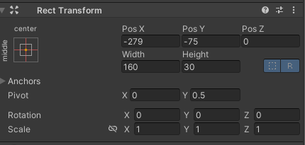

## Basic Layout

### Rect Transform
The **Rect Transform** is a new transform component that is used for all UI elements instead of the regular **Transform** component.

Rect Transforms have position, rotation, and scale just like regular Transforms, but it also has a width and height, used to specify the dimensions of the rectangle.

### Resizing Versus Scaling
When the Rect Tool is used to change the size of an object, normally for Sprites in the 2D system and for 3D objects it will change the local scale of the object. However, when it's used on an object with a Rect Transform on it, it will instead change the width and the height, keeping the local scale unchanged. This resizing will not affect font sizes, border on sliced images, and so on.

### Pivot
Rotations, size, and scale modifications occur around the pivot so the position of the pivot affects the outcome of a rotation, resizing, or scaling. When the toolbar Pivot button is set to Pivot mode, the pivot of a Rect Transform can be moved in the Scene View.

### Anchors
Rect Transforms include a layout concept called **anchors**. Anchors are shown as four small triangular handles in the Scene View and anchor information is also shown in the Inspector.

If the parent of a Rect Transform is also a Rect Transform, the child Rect Transform can be anchored to the parent Rect Transform in various ways. For example, the child can be anchored to the center of the parent, or to one of the corners.

You can drag each of the anchors individually, or if they are together, you can drag them together by clicking in the middle in between them and dragging. If you hold down Shift key while dragging an anchor, the corresponding corner of the rectangle will move together with the anchor.

A useful feature of the anchor handles is that they automatically snap to the anchors of sibling rectangles to allow for precise positioning.

#### Anchor presets

In the Inspector, the **Anchor Preset** button can be found in the upper left corner of the Rect Transform component. Clicking the button brings up the Anchor Presets dropdown. From here you can quickly select from some of the most common anchoring options. You can anchor the UI element to the sides or middle of the parent, or stretch together with the parent size. The horizontal and vertical anchoring is independent.

### ref 
https://docs.unity3d.com/Packages/com.unity.ugui@1.0/manual/UIBasicLayout.html
