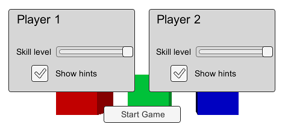
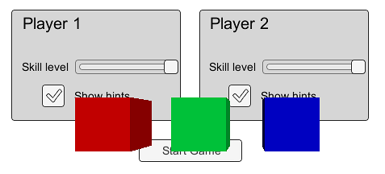

## Canvas
The Canvas is the area that all UI elements should be inside. 

> The Canvas is a Game Object with a **Canvas component** on it, and all UI elements **must be children** of such a Canvas.

Creating a **new UI element**, **such as an Image** using the menu **GameObject > UI > Image**, **automatically creates a Canvas**, if there isn't already a Canvas in the scene. The UI element is created as a child to this Canvas.

The Canvas area is shown as a rectangle in the Scene View. This makes it easy to position UI elements without needing to have the Game View visible at all times.

Canvas uses the **EventSystem** object to help the Messaging System.

### Draw order of elements

> UI elements in the Canvas are drawn in the same order they appear in the Hierarchy. The first child is drawn first, the second child next, and so on.
> If two UI elements overlap, the later one will appear on top of the earlier one.

To change which element appear on top of other elements, simply **reorder the elements in the Hierarchy** by dragging them. 

The order can also be controlled from scripting by using these methods on the **Transform component**: `SetAsFirstSibling`, `SetAsLastSibling`, and `SetSiblingIndex`.

### Render Modes
The Canvas has a **Render Mode** setting which can be used to make it render in **screen space** or **world space**.

- **Screen Space - Overlay** \
  This render mode places UI elements on the screen rendered on top of the scene. If the screen is resized or changes resolution, the Canvas will automatically change size to match this.
  In this mode, the Canvas is scaled to fit the screen and then rendered directly without reference to the scene or a camera (the UI will be rendered even if there is no camera in the scene at all). If the screen's size or resolution are changed then the UI will automatically rescale to fit. The UI will be drawn over any other graphics such as the camera view.
  > **Note**: The Screen Space - Overlay canvas needs to be stored at the top level of the hierarchy. If this is not used then the UI may disappear from the view. This is a built-in limitation. Keep the Screen Space - Overlay canvas at the top level of the hierarchy to get expected results.

  

- **Screen Space - Camera** \
This is similar to **Screen Space - Overl**ay, but in this render mode the Canvas is placed a **given distance in front of a specified Camera**.
The **UI elements are rendered by this camera**, which means that the **Camera settings affect the appearance of the UI**.
  > If the Camera is set to Perspective, the UI elements will be rendered with perspective, and the amount of perspective distortion can be controlled by the Camera Field of View.
  > If the screen is resized, changes resolution, or the camera frustum changes, the Canvas will automatically change size to match as well.
  
  In this mode, the Canvas is rendered as if it were drawn on a plane object some distance in front of a given camera. The onscreen size of the UI does not vary with the distance since it is always rescaled to fit exactly within the camera frustum. If the screen's size or resolution or the camera frustum are changed then the UI will automatically rescale to fit. Any 3D objects in the scene that are closer to the camera than the UI plane will be rendered in front of the UI, while objects behind the plane will be obscured.

  

  
- **World Space** \
  In this render mode, the Canvas will behave as any other object in the scene. The size of the Canvas can be **set manually using its Rect Transform**, and UI elements will **render in front of or behind other objects in the scene** based on 3D placement.
  This mode renders the UI as if it were a plane object in the scene. Unlike **Screen Space - Camera** mode, however, the plane need not face the camera and can be oriented however you like. The size of the Canvas can be set using its Rect Transform but its onscreen size will depend on the viewing angle and distance of the camera. Other scene objects can pass behind, through or in front of the Canvas.
  
  This is useful for UIs that are meant to be a part of the **world**. This is also known as a **"diegetic interface"**.

  

### Canvas Scaler component
The **Canvas Scaler component** is used for controlling the overall scale and pixel density of UI elements in the Canvas. This **scaling affects everything under the Canvas**, including font sizes and image borders.

### Canvas Group
The Canvas Group can be used to **control certain aspects of a whole group of UI elements** from one place without needing to handle them each individually. The properties of the Canvas Group affect the GameObject it is on **as well as all children**.

Typical uses of Canvas Group are:

-   Fading in or out a whole window by adding a Canvas Group on the GameObject of the Window and control its Alpha property.
-   Making a whole set of controls non-interactable ("grayed out") by adding a Canvas Group to a parent GameObject and setting its Interactable property to false.
-   Making one or more UI elements not block mouse events by placing a Canvas Group component on the element or one of its parents and setting its Block Raycasts property to false.

### ref 

https://docs.unity3d.com/Packages/com.unity.ugui@1.0/manual/UICanvas.html

Canvas \
https://docs.unity3d.com/Packages/com.unity.ugui@1.0/manual/class-Canvas.html

Canvas scaler \
https://docs.unity3d.com/Packages/com.unity.ugui@1.0/manual/script-CanvasScaler.html

Canvas Group \
https://docs.unity3d.com/Packages/com.unity.ugui@1.0/manual/class-CanvasGroup.html

Canvas Renderer \
https://docs.unity3d.com/Packages/com.unity.ugui@1.0/manual/class-CanvasRenderer.html

