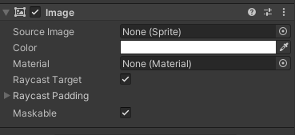

## Image

Image is a textured element in the UI hierarchy. **Every interaction component/ selectable component(eg: button, toggle etc.) has this component**. 


### Image Component




| **Property:** | **Function:** |
| --- | --- |
| **Source Image** | The Texture that represents the image to display (which must be imported as a Sprite. |
| **Color** | The color to apply to the image. |
| **Material** | The Material to use for rendering the image. |
| **Raycast Target** | Enable **Raycast Target** if you want Unity to consider the image a target for raycasting. |
| **Preserve Aspect** | Ensure the image retains its existing dimension. |
| **Set Native Size** | Set the dimensions of the image box to the original pixel size of the Texture. |

### Image vs Raw image component

The Image control requires its Texture to be a Sprite, while the Raw Image can accept any Texture.


Raw Image: https://docs.unity3d.com/Packages/com.unity.ugui@1.0/manual/script-RawImage.html

### Image class

**object(C#) -> Object(Unity) -> Component -> Behaviour -> MonoBehaviour -> UIBehaviour -> Graphic -> MaskableGraphic -> Image**


> Inherits Graphic class


To change **color** of the interaction component:

Eg:
```cs
button.GetComponent<Image>().color = Color.red;

```

To access matrial:

Eg:
```cs
XXX.GetComponent<Image>().material
```

To set whether is raycast target or not:

Eg:
```cs
XXX.GetComponent<Image>().raycastTarget
```


### ref 

**Image Class**: \
https://docs.unity3d.com/Packages/com.unity.ugui@2.0/api/UnityEngine.UI.Image.html

**Image Component**: \
https://docs.unity3d.com/Packages/com.unity.ugui@3.0/manual/script-Image.html
