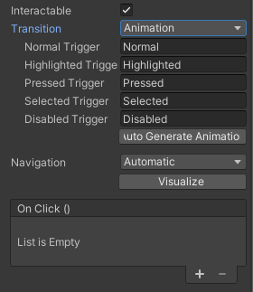
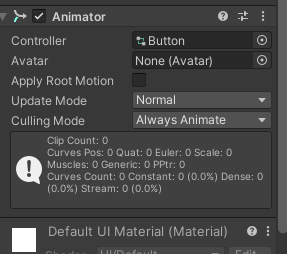
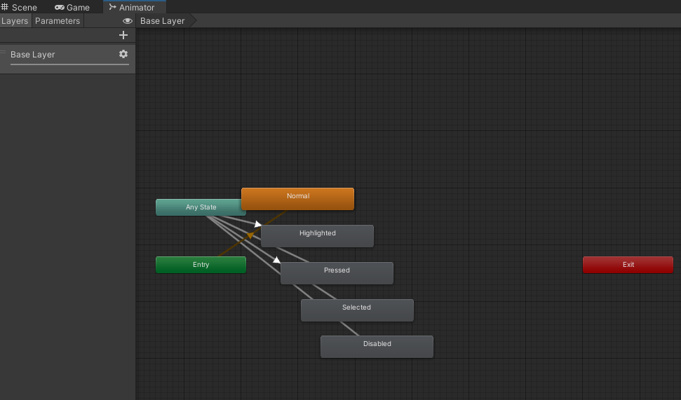

## Unity UI (uGUI)

Unity UI is a set of tools for developing user interfaces for games and applications. The Unity User Interface (Unity UI) package (also called uGUI) is **an older, GameObject-based UI system** that you can use to develop runtime UI for games and applications. 

It is a **GameObject-based UI system** that uses **Components and the Game View to arrange, position, and style user interfaces**. 

You cannot use Unity UI to create or change user interfaces in the Unity Editor.

**GameObject > UI / Component > UI**

### Visual Components
- Text
- Image
- Raw Image
- Mask
- RectMask2D
- UI Effect Components

https://docs.unity3d.com/Packages/com.unity.ugui@2.0/manual/UIVisualComponents.html \
https://docs.unity3d.com/Packages/com.unity.ugui@2.0/manual/comp-UIVisual.html

### Interaction Components
The interaction components are **not visible on their own**, and **must be combined with one or more visual components** in order to work correctly. **Interaction components: Visual components + Selectable Base Class(Script)**.

Most of the interaction components have some things in common. They are selectables, which means they have shared built-in functionality for visualising transitions between states (normal, highlighted, pressed, disabled), and for navigation to other **selectables** using keyboard or controller. 

> The interaction components have at least one **`UnityEvent`** that is invoked when user interacts with the component in specific way. The UI system catches and logs any exceptions that propagate out of code attached to **`UnityEvent`**.

- Selectable Base Class
- Button
- Toggle
- Toggle Group
- Slider
- Scrollbar
- Scroll Rect(Scroll View)
- InputField

https://docs.unity3d.com/Packages/com.unity.ugui@2.0/manual/UIInteractionComponents.html \
https://docs.unity3d.com/Packages/com.unity.ugui@2.0/manual/comp-UIInteraction.html

### Animation Integration

Animation allows for each transition between control states to be fully animated using Unity's animation system. This is the most powerful of the transition modes due to the number of properties that can be animated simultaneously.

To use the **Animation transition mode**, an **Animator Component** needs to be attached to the controller element. \
This can be **done automatically** by clicking **"Auto Generate Animation"**. \
This also **generates an Animator Controller with states already set up**, which will need to be saved.

The new Animator controller is ready to use straight away. Unlike most Animator Controllers, this controller also stores the animations for the controller's transitions and these can be customised, if desired.

### ref
https://github.com/Unity-Technologies/uGUI/tree/2019.1

https://docs.unity3d.com/Packages/com.unity.ugui@2.0/manual/index.html

**`UnityEngine.UI` scripting API** \
https://docs.unity3d.com/Packages/com.unity.ugui@2.0/api/UnityEngine.UI.html

**`UnityEditor.UI` scripting API** \
https://docs.unity3d.com/Packages/com.unity.ugui@2.0/api/UnityEditor.UI.html

**uGUI reference** \
https://docs.unity3d.com/Packages/com.unity.ugui@2.0/manual/UIReference.html

**uGUI Scripting API** \
https://docs.unity3d.com/Packages/com.unity.ugui@2.0/api/index.html

