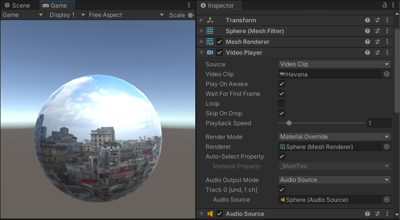

## Video
Use **Unity’s video system** to integrate video into your game. 
Video footage can **add realism**, **save on rendering complexity**, or help you integrate content available externally.

To use video in Unity, import **Video Clips** and configure them using the **Video Player component**. The system allows you to feed video footage directly into the **Texture parameter** of any component that has one. Unity then plays the Video on that **Texture** at run time.

### ref
https://docs.unity3d.com/Manual/VideoPlayer.html

https://www.youtube.com/watch?v=3gtGPLELKBs

https://www.youtube.com/watch?v=1903h0KI7tE

https://www.youtube.com/watch?v=j08xnfqorJM

https://www.youtube.com/watch?v=nADTdV8wsXQ

