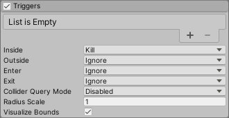

## Triggers module

The Built-in Particle System’s Triggers module allows you to **access and modify particles** based on their **interaction with one or more Colliders** in the Scene
. When you enable this module, the Particle System calls the **`OnParticleTrigger()`** callback on attached scripts
, which you can use to access lists of particles depending on where they are in respect to the Colliders in the Scene.




### Using the Triggers module
This module is part of the Particle System component. When you create a new Particle System GameObject
, or add a Particle System component to an exiting GameObject, Unity adds the Triggers module to the Particle System. By default, Unity disables this module. To create a new Particle System and enable this module:

-   Click **GameObject** > **Effects** > **Particle System**.
-   In the **Inspector**, find the Particle System component.
-   In the Particle System component, find the Triggers module fold-out.
-   To the left of the fold-out header, enable the checkbox.


To begin, specify which Colliders in the Scene the particles can interact with. To do this, assign one or more Colliders to the Colliders list property. To increase the number of Colliders in the list, click the Add (+) button beneath the list of Colliders. To remove a Collider from the list, select the Collider and click the Remove (-) button. If you have not yet assigned a Collider to an index of the list, you can use the smaller Add (+) button, to the right of the empty entry, to create and assign a new Collider. This creates a new GameObject as a child of the Particle System and attaches a Sphere Collider to it, then assigns the Collider to the empty entry.


After you add the Colliders, you can then specify what a particle does when it meets the criteria for passing a particular trigger event type. There are four event types that **describe how a particle can interact with a Collider**. They are:


-   **Inside**: A particle is inside a Collider’s bounds.
-   **Outside**: A particle is outside a Collider’s bounds.
-   **Enter**: A particle enters a Collider’s bounds.
-   **Exit**: A particle exits a Collider’s bounds.


In the Inspector, there is a drop-down for each of these event types that lets you select what should happen to a particle if it passes the trigger event’s conditions. The options are:

-   **Callback**: **Allows you to access** the particle in the **`OnParticleTrigger()`** callback function.
-   **Kill**: **Destroys the particle**. You can not access the particle in the **`OnParticleTrigger()`** callback function.
-   **Ignore**: **Ignores the particle**. You can not access the particle in the **`OnParticleTrigger()`** callback function.


| **Property** | **Description** |
| --- | --- |
| **Inside** | Specifies the action the Particle System takes for particles every frame they are inside a Collider. The options are:  • **Callback**: Adds the particle to a list which you can retrieve in the `OnParticleTrigger()` callback  • **Kill**: Destroys the particle. • **Ignore**: Ignores the particle. |
| **Outside** | Specifies the action the Particle System takes for particles every frame they are outside a Collider. The options are:  • **Callback**: Adds the particle to a list which you can retrieve in the `OnParticleTrigger()` callback  • **Kill**: Destroys the particle. • **Ignore**: Ignores the particle. |
| **Enter** | Specifies the action the Particle System takes for particles in the frame they enter a Collider. The options are: • **Callback**: Adds the particle to a list which you can retrieve in the `OnParticleTrigger()` callback • **Kill**: Destroys the particle. • **Ignore**: Ignores the particle. |
| **Exit** | Specifies the action the Particle System takes for particles in the frame they exit a Collider. The options are: • **Callback**: Adds the particle to a list which you can retrieve in the `OnParticleTrigger()` callback  • **Kill**: Destroys the particle. • **Ignore**: Ignores the particle. |
| **Collider Query Mode** | Specifies the method this Particle System uses to get information about the Colliders that particles interact with. This increases the resource intensity of processing the Triggers module so, if you do not need any extra collision information, set this property to **Disabled**. The options are:  • **Disabled**: Does not get any information about which Collider each particle interacts with.  • **One**: Gets information about the first Collider each particle interacts. If a particle interacts with multiple Colliders in the frame, this returns the first Collider in the **Collider** list the particle interacted with.  • **All**: Gets information about every Collider each particle interacts with. |
| **Radius Scale** | The particle’s Collider bounds. This allows you to match the particle’s Collider bounds to the visual appearance of the particle more closely. This is useful if a particle is circular with a fade in its texture because the default particle Collider would be inside the trigger before the particle visually looks to be. Note that this setting does not change when the event actually triggers, but can delay or advance the visual effect of the trigger.  • Enter **1** to keep the particle Colliders the same size and for the event to appear to happen as a particle touches the Collider. • Enter a value less than **1** to make the particle Colliders smaller and for the trigger to appear to happen after a particle penetrates the Collider • Enter a value greater than **1** to make the particle Colliders larger and for the trigger to appear to happen before a particle penetrates the Collider |
| **Visualize Bounds** | Indicates whether to display the Collider bounds of each particle in the **Scene view**. Enable this property to display the Collider bounds and disable it to hide the Collider bounds. |


### Accessing particles within OnParticleTrigger()

If you select Callback as the reaction to one of the trigger events, 
you can **access the particles that fulfill the event condition from an attached script**. 
To do this, you first need to add the `OnParticleTrigger()` function to an attached script. 
Inside this function, call the `ParticlePhysicsExtensions.GetTriggerParticles()` function to get the list of particles that fulfill the trigger event’s criteria. 
This function takes a `ParticleSystemTriggerEventType`, which specifies the trigger event you want to get the particles for (**Inside, Outside, Enter, or Exit**), and a list of Particles which the function populates with the result. 
From the list, you can access, modify, or destroy any particle. The function can also take an optional parameter which outputs collision information, such as which Collider each **particle triggered**. The Collider Query Mode property controls what information is available through this parameter.


Example:

**Interaction with a collider** 
```cs
using UnityEngine;
using System.Collections;
using System.Collections.Generic;

[ExecuteInEditMode]
public class TriggerScript : MonoBehaviour
{
    ParticleSystem ps;

    // these lists are used to contain the particles which match
    // the trigger conditions each frame.
    List<ParticleSystem.Particle> enter = new List<ParticleSystem.Particle>();
    List<ParticleSystem.Particle> exit = new List<ParticleSystem.Particle>();

    void OnEnable()
    {
        ps = GetComponent<ParticleSystem>();
    }

    void OnParticleTrigger()
    {
        // get the particles which matched the trigger conditions this frame
        int numEnter = ps.GetTriggerParticles(ParticleSystemTriggerEventType.Enter, enter);
        int numExit = ps.GetTriggerParticles(ParticleSystemTriggerEventType.Exit, exit);

        // iterate through the particles which entered the trigger and make them red
        for (int i = 0; i < numEnter; i++)
        {
            ParticleSystem.Particle p = enter[i];
            p.startColor = new Color32(255, 0, 0, 255);
            enter[i] = p;
        }

        // iterate through the particles which exited the trigger and make them green
        for (int i = 0; i < numExit; i++)
        {
            ParticleSystem.Particle p = exit[i];
            p.startColor = new Color32(0, 255, 0, 255);
            exit[i] = p;
        }

        // re-assign the modified particles back into the particle system
        ps.SetTriggerParticles(ParticleSystemTriggerEventType.Enter, enter);
        ps.SetTriggerParticles(ParticleSystemTriggerEventType.Exit, exit);
    }
}

```

**Interaction with multiple colliders** 
```cs
using UnityEngine;
using System.Collections;
using System.Collections.Generic;

[ExecuteInEditMode]
public class TriggerScript : MonoBehaviour
{
    void OnParticleTrigger()
    {
        ParticleSystem ps = GetComponent();
 
        // particles
        List inside = new List();
        List exit = new List();
 
        // get
        int numInside = ps.GetTriggerParticles(ParticleSystemTriggerEventType.Inside, inside, out var insideData);
        int numExit = ps.GetTriggerParticles(ParticleSystemTriggerEventType.Exit, exit);
 
        // iterate
        for (int i = 0; i < numInside; i++)
        {
            ParticleSystem.Particle p = inside[i];
            if (insideData.GetColliderCount(i) == 1)
            {
                if (insideData.GetCollider(i, 0) == ps.trigger.GetCollider(0))
                    p.startColor = new Color32(255, 0, 0, 255);
                else
                    p.startColor = new Color32(0, 0, 255, 255);
            }
            else if (insideData.GetColliderCount(i) == 2)
            {
                p.startColor = new Color32(0, 255, 0, 255);
            }
            inside[i] = p;
        }
        for (int i = 0; i < numExit; i++)
        {
            ParticleSystem.Particle p = exit[i];
            p.startColor = new Color32(1, 1, 1, 255);
            exit[i] = p;
        }
 
        // set
        ps.SetTriggerParticles(ParticleSystemTriggerEventType.Inside, inside);
        ps.SetTriggerParticles(ParticleSystemTriggerEventType.Exit, exit);
    }
}


```

### ref
https://docs.unity3d.com/Manual/PartSysTriggersModule.html

