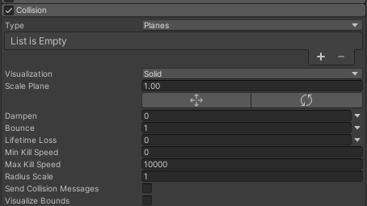

## Particle system collision

### Collision module

This module controls how particles **collide with GameObjects in the Scene**. Use the first drop-down to define whether your collision settings apply to Planes or to the World
. If you choose World, use the Collision Mode drop-down to define whether your collision settings apply for a 2D or 3D world.

-   Click **GameObject** > **Effects** > **Particle System**.
-   In the **Inspector**, find the Particle System component.
-   In the Particle System component, find the **Collision module** fold-out.
-   To the left of the fold-out header, **enable the checkbox**.


When other objects surround a Particle System, the effect is often more convincing when the particles interact with those objects. For example, water or debris should be obstructed by a solid wall rather than simply passing through it

> With the Collision module enabled, **particles can collide with objects in the Scene**.

A Particle System can be set so its **particles collide with any Collider** in the scene by selecting **World** mode from the pop-up. \
Colliders can also be **disabled according to the layer they are on** by using the **Collides With** property. \
The pop-up also has a **Planes** mode option which allows you to **add a set of planes to the Scene that don’t need to have Colliders**. This option is useful for **simple floors, walls and similar objects**, and has a lower processor overhead than **World** mode.




https://docs.unity3d.com/Manual/PartSysCollisionModule.html


### `MonoBehaviour.OnParticleCollision(GameObject)`

`OnParticleCollision` is called when a particle hits a Collider.

This can be used to apply damage to a GameObject when hit by particles.

Detecting collisions between particles and game objects in Unity involves using Unity's physics system and collision events. Unity's Particle System provides a built-in collision module that allows particles to interact with colliders in the scene. Here's a step-by-step guide on how to achieve collision detection between particles and game objects:

1. Set up Particle System with Collision Module:
Create a particle system by selecting **"GameObject" > "Effects" > "Particle System"** in the Unity editor.

In the Inspector window, find the **"Collision Module"** under the Particle System module.

Enable the **"Collision Module"** by checking the checkbox.

Adjust the settings in the Collision Module according to your requirements. You can specify the type of collision, bounce, and other parameters.

2. Add Collider to Game Object:
Make sure the game object with which you want particles to collide has a collider component attached to it (e.g., Box Collider, Sphere Collider, etc.).
3. Handle Collision Events in Script:
- Create a C# script to handle collision events. Attach this script to the game object that has the collider.

```cs
public class ParticleCollisionHandler : MonoBehaviour
{
    private void OnParticleCollision(GameObject other)
    {
        Debug.Log("Particle collided with: " + other.name);
        
        // Add your custom logic here
    }
}
```
The **`OnParticleCollision`** method is called when a particle collides with the collider attached to the game object.

4. Fine-Tune Collision Events (Optional):
- You can customize the collision events further by using the information provided by the **`OnParticleCollision`** method, such as getting the collision point, normal, and other relevant data.

```cs
private void OnParticleCollision(GameObject other)
{
    ContactPoint[] collisionPoints = new ContactPoint[particleCollisionEvent.intersectionCount];
    int count = particleCollisionEvent.GetContacts(collisionPoints);

    for (int i = 0; i < count; i++)
    {
        ContactPoint contact = collisionPoints[i];
        Debug.Log("Collision Point: " + contact.point);
        Debug.Log("Collision Normal: " + contact.normal);
        
        // Add your custom logic here
    }
}
```


```cs
using UnityEngine;
using System.Collections;
using System.Collections.Generic;

public class ExampleClass : MonoBehaviour
{
    public ParticleSystem part;
    public List<ParticleCollisionEvent> collisionEvents;

    void Start()
    {
        part = GetComponent<ParticleSystem>();
        collisionEvents = new List<ParticleCollisionEvent>();
    }

    void OnParticleCollision(GameObject other)
    {
        int numCollisionEvents = part.GetCollisionEvents(other, collisionEvents);

        Rigidbody rb = other.GetComponent<Rigidbody>();
        int i = 0;

        while (i < numCollisionEvents)
        {
            if (rb)
            {
                Vector3 pos = collisionEvents[i].intersection;
                Vector3 force = collisionEvents[i].velocity * 10;
                rb.AddForce(force);
            }
            i++;
        }
    }
}

```

### `MonoBehaviour.OnTriggerEnter(Collider)`

Detecting collisions between a game object and a particle system itself (as opposed to individual particles) is not directly supported by Unity's built-in physics system, as particle systems don't have collider components by default. However, you can implement a workaround using script-based solutions.

Here's an example using a script to detect when a game object collides with a particle system:

1. Create a C# Script:

```cs
public class GameObjectCollisionHandler : MonoBehaviour
{
    private void OnTriggerEnter(Collider other)
    {
        if (other.CompareTag("ParticleSystem"))
        {
            Debug.Log("Game object collided with particle system!");

            // Add your custom logic here
        }
    }
}

```

2. Add a Collider to the Particle System:
- Add a collider component (e.g., **Box Collider, Sphere Collider**) to the GameObject containing the Particle System.

3. Tag the Particle System:
- Tag the GameObject with the Particle System with a unique tag (e.g., **"ParticleSystem"**).

4. Attach the Script:
- Attach the script to the GameObject that should detect collisions with the particle system.

5. Adjust Collider Settings:
- Make sure the collider on the GameObject is properly configured and set as a trigger.

#### Additional Notes:

-   This method treats the entire particle system as a single collider. If you want more detailed interaction with individual particles, you may need a more complex solution, potentially involving custom particle collision detection in your script.
    
-   Always ensure that you set up the collider and trigger settings correctly on both the GameObject and Particle System.
    
-   Adjust the script and collider settings according to your specific requirements.
    

Remember that this workaround is a simplified solution and may not provide detailed interactions with individual particles within the particle system. If you need more granular control, you might consider using a custom particle collision system or a physics-based solution tailored to your specific use case.


### ref 
https://www.youtube.com/watch?v=zMgSq3O8FE0
