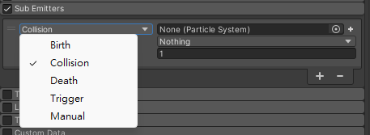

## Sub Emitters module

This module allows you to set up **sub-emitters**. These are **additional particle emitters** that **are created at a particle’s position at certain stages of its lifetime**.

#### Using the Sub Emitters module
This module is part of the Particle System component. When you create a new Particle System GameObject, or add a Particle System component to an exiting GameObject, Unity adds the Sub Emitters module to the Particle System. By default, Unity disables this module. To create a new Particle System and enable this module:

1. Click **GameObject > Effects > Particle System**.
2. In the Inspector, find the **Particle System component**.
3. In the Particle System component, find the **Sub Emitters module** fold-out.
4. To the left of the fold-out header, **enable the checkbox**.

Many types of particles produce effects at different stages of their lifetimes that can also be implemented using Particle Systems. For example, a bullet might be accompanied by a puff of smoke powder as it leaves the gun barrel, and a fireball might explode on impact. You can use sub-emitters to create effects like these.

Sub-emitters are ordinary Particle System objects created in the Scene
 or from Prefabs
. This means that sub-emitters can have sub-emitters of their own (this type of arrangement can be useful for complex effects like fireworks). However, it is very easy to generate an enormous number of particles using sub-emitters, which can be resource intensive.

To trigger a sub-emitter, you can use these are the conditions:

- **Birth**: When the particles are created.
- **Collision**: When the particles collide with an object.
- **Death**: When the particles are destroyed.
- **Trigger**: When the particles interact with a Trigger **collider**.
- **Manual**: Only triggered when requested via script. 

> Note that the **Collision, Trigger, Death and Manual** events can only use burst emission in the **Emission** module.

Additionally, you can transfer properties from the parent particle to each newly created particle using the Inherit options. The transferrable properties are size, rotation, color and lifetime. To control how velocity is inherited, configure the Inherit Velocity module on the sub-emitter system.

It is also possible to configure a probability that a sub-emitter event will trigger, by setting the Emit Probability property. A value of 1 guarantees that the event will trigger, whereas lower values reduce the probability.

### ref 
https://docs.unity3d.com/Manual/PartSysSubEmitModule.html

