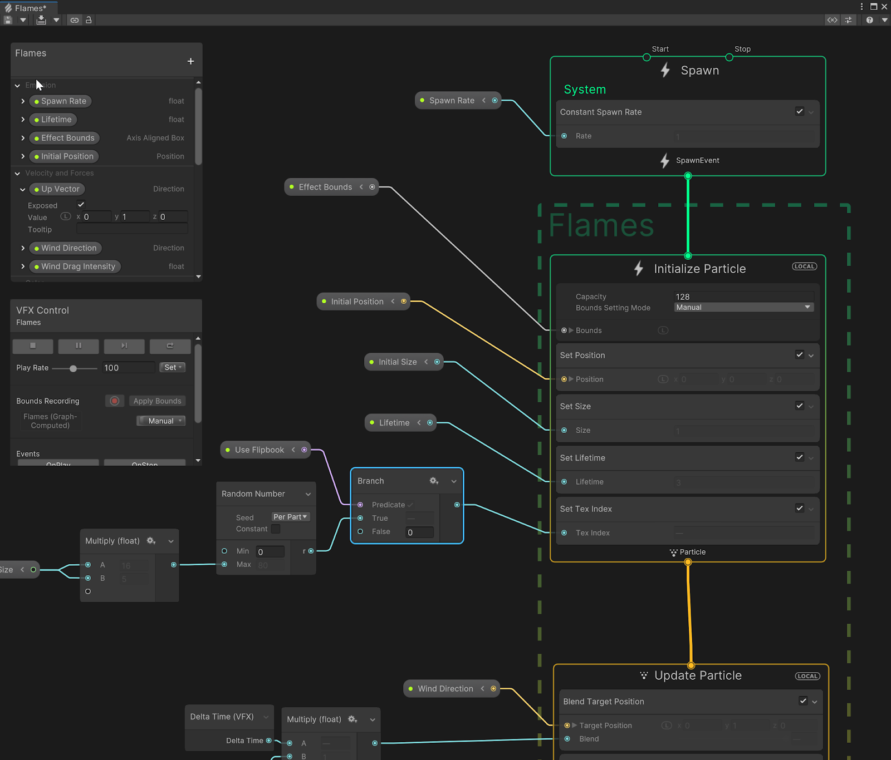

## Visual Effect Graph

The Visual Effect Graph is a package that you can use to create large-scale visual effects for your Unity Project. 

> **Note**: The Visual Effect Graph simulates particle behavior on the GPU, which allows it to simulate many more particles than the Built-in Particle System.

If you want to **create visual effects that include a large number of particles** and need highly customisable behavior, use the **Visual Effect Graph** instead of the Built-in Particle System.

### VFX
The VFX tab in the Project Settings window controls settings relevant to the Visual Effect Graph.

This tab is only visible if you install the Visual Effect Graph package. For information on how to install the Visual Effect Graph

### ref
https://docs.unity3d.com/Packages/com.unity.visualeffectgraph@16.0/manual/index.html

https://unity.com/visual-effect-graph

### Scripting API
https://docs.unity3d.com/Packages/com.unity.visualeffectgraph@16.0/api/index.html

