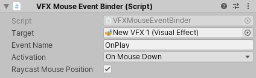

## Event Binders
**Event Binders** refer to a **set of MonoBehaviour Scripts that help you trigger Events in Visual Effects** when a particular event happens in the Scene. 

 For example, when a Renderer becomes visible. Event Binders can also attach Event Attribute Payloads to the Events that they send.

 ### Mouse Event Binder

 The Mouse Event Binder triggers an event in the target Visual Effect based on actions that you perform with the mouse (for example, clicking, hovering, or dragging).

 

 

### ref
https://docs.unity3d.com/Packages/com.unity.visualeffectgraph@17.0/manual/EventBinders.html

