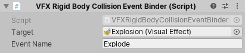
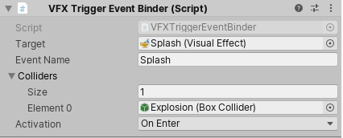
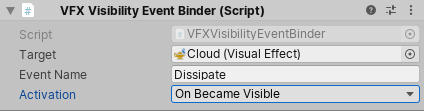

## Event Binders
**Event Binders** refer to a **set of MonoBehaviour Scripts that help you trigger Events in Visual Effects** when a **particular event happens in the Scene**. 

 For example, when a Renderer becomes visible. Event Binders can also attach Event Attribute Payloads to the Events that they send.

 ### Mouse Event Binder

 The Mouse Event Binder **triggers an event in the target Visual Effect based on actions that you perform with the mouse** (for example, clicking, hovering, or dragging).

 

 > **Require**s: A **Collider** on the **same GameObject as this component**.

| **Property** | **Description** |
| --- | --- |
| **Target** | The Visual Effect instance to trigger the Event on. |
| **Event Name** | The name of the Event to trigger. |
| **Activation** | Specifies when this component triggers the Event:  • **`OnMouseDown`**: When you click down on the Collider.  • **`OnMouseUp`**: When you release a click on the Collider.  • **`OnMouseEnter`**: When the cursor enters the Collider's on-screen area.  • **`OnMouseExit`**: When the cursor exits the Collider's on-screen area.  • **`OnMouseOver`**: When the cursor hovers over the Collider's on-screen area.  • **`OnMouseDrag`**: When you drag the mouse over the Collider's on-screen area. |
| **Raycast Mouse Position** | Specifies whether to use a `po` |

### Rigid Body Collision Event Binder

The **Rigid Body Collision Event Binder** triggers an **Event in the target Visual Effect every time something collides with the Rigidbody attached to the same GameObject as this component**. This binder also attaches the collision world position to the **`position` EventAttribute**, and the contact Normal to the **`velocity` EventAttribute**.

> **Requires**: A **Rigidbody and a Collider on the same GameObject as this component**.

| **Properties** | **Description** |
| --- | --- |
| **Target** | The Visual Effect instance to trigger the Event on. |
| **Event Name** | The name of the event to trigger. |

### Trigger Event Binder

The **Trigger Event Binder** **triggers an Event in the target Visual Effect every time a Collider from a list interacts with the attached trigger Collider**. This binder also attaches the world position of the Collider instigator to the **`position` EventAttribute**.

> **Requires:** A Collider with **`Is Trigger` set to true on the same GameObject as this component**.

| **Property** | **Description** |
| --- | --- |
| **Target** | The Visual Effect instance to trigger the Event on. |
| **Event Name** | The name of the Event to trigger. |
| **Colliders** | A list of Colliders that trigger the Event when something interacts with them. |
| **Activation** | Specifies which action triggers the Event:  • **`OnEnter`**: Triggers the Event when any Collider enters the trigger.  • **`OnExit`**: Triggers the Event when any Collider exits the trigger.  • **`OnStay`**: Triggers the Event when any Collider stays in the trigger. |

### Visibility Event Binder

The Visibility Event Binder triggers an Event in the target Visual Effect every time the Renderer attached to this GameObject becomes visible or invisible.

> **Requires**: A **Renderer on the same GameObject as this component**.

| **Property** | **Description** |
| --- | --- |
| **Target** | The Visual Effect instance to trigger the Event on. |
| **Event Name** | The name of the Event to trigger. |
| **Activation** | Specifies when to trigger the Event:  • **`OnBecameVisible`**: Triggers the Event on the frame that the Renderer goes from invisible to visible.  • **`OnBecameInvisible`**: Triggers the Event on the frame that the Renderer goes from visible to invisible. |

### ref
https://docs.unity3d.com/Packages/com.unity.visualeffectgraph@17.0/manual/EventBinders.html

