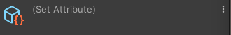
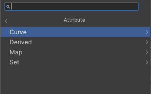
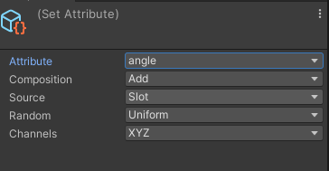

## Attributes
An Attribute is **a piece of data attached to elements in a System**. \
For example, the **color of a particl**e, a **particle's position**, or **the amount of particles** that a spawn System creates are all Attributes.

**Systems can read from, or write to**, Attributes in order to perform custom behavior and differentiate between elements.

A **System only stores Attributes when it needs them**. This means that the System **does not store any unnecessary data** and thus saves memory.

Use nodes to read from or write to Attributes. In particular, use the:

-   **Get Attribute Operator** to read from Attributes in the **Particle** or **ParticleStrip System**
-   **Experimental** **Spawner Callbacks** to read from Attributes in **Spawn systems**
-   **Set Attribute Block** to write values to an Attribute; either set the value of the Attribute directly or use a random mode (for example, set a **Color Attribute** with a **Random Gradient** or **Random Per-component Block**

> **Note**: A System only stores Attributes when it needs them. In order to save memory, it does not store any unnecessary data. If you read that the VFX Graph has not stored the simulation data from an Attribute, the Attribute passes its default constant value.

When you add set Attribute block to the context, it show set Attribute in inspector

### Set Attribute block

> You can add block for Setting Attribute based on these menu path: **Curve, Derived, Map or Set**.

#### Set
Menu Path : **Attribute > Set > [Add/Blend/Inherit/Multiply/Set\] <Attribute>**

The **Set Attribute** Block is a generic Block that allows you to write values to an attribute using composition.

You can either set the value of the attribute directly, or use two different random modes, **Uniform** and **Per-Component**, to set the attribute to a random value.

-   **Uniform** calculates a single random number in range 0 to 1 then, to produce the final value, uses the random value to interpolate between the two range values (**A** and **B**).
    
-   **Per-Component** calculates a random number in range 0 to 1 for each component in the attribute type then, to produce the final value, uses each random value to interpolate between each component of the two range values (**A** and **B**).

**Set Attribute in inspector(Block settings)**:

| **Setting** | **Type** | **Description** |
| --- | --- | --- |
| **Attribute** | Attribute (Inspector Only) | **(Inspector)** Specifies the attribute to write to. |
| **Composition** | Enum (Inspector Only) | **(Inspector)** Specifies how this Block composes the attribute. The options are:  • **Overwrite**: Overwrites the position attribute with the new value.  • **Add**: Adds the new value to the position attribute value.  • **Multiply**: Multiplies the position attribute value by the new value.  • **Blend**: Interpolates between the position attribute value and the new value. You can specify the blend factor between 0 and 1. |
| **Source** | Enum (Inspector Only) | **(Inspector)** Specifies the source of the attribute. The options are: • **Slot**: Calculates the value from the Block’s input property ports. • **Source**: Takes the value from the source attribute of the same name. |
| **Random** | Enum | **(Inspector)** Specifies how the Block calculates the value to compose to the attribute. The options are: • **Off** : Does not calculate a random value for the attribute. Uses the value you provide in the input directly. • **PerComponent**: Calculates a random value for each of the attribute's components. • **Uniform** : Calculates a single random value and uses it for each of the attribute's components. |
| **Channels** | Enum | Specifies which channels of the attribute to affect. This Operator has no effect on channels you do not specify with this setting. This setting is only visible if the **Attribute** you set is one with channels. |

**Block properties**:

| **Input** | **Type** | **Description** |
| --- | --- | --- |
| **<Attribute>** | Depends on the attribute | The value to compose to the attribute.  
This property only appears if you set **Source** to **Slot** and **Random** to **Off**. |
| **A** | Depends on the attribute | The first end of the random range the Block uses to calculate the value for the attribute. This property only appears if you set **Source** to **Slot** and **Random** to **PerComponent** or **Uniform**. |
| **B** | Depends on the attribute | The other end of the random range the Block uses to calculate the value for the attribute. This property only appears if you set **Source** to **Slot** and **Random** to **PerComponent** or **Uniform**. |
| **Blend** | Float (Range 0..1) | The blend percentage between the current position attribute value and the newly calculated position value. This property only appears if you set **Composition** to **Blend**. |

https://docs.unity3d.com/Packages/com.unity.visualeffectgraph@17.0/manual/Block-SetAttribute.html

#### Map
Menu Path : **Attribute > Set <Attribute> From Map**

The **Set Attribute from Map** Block is a generic Block that calculates values based on data it samples from Textures and then composes those values into a given **attribute.**

https://docs.unity3d.com/Packages/com.unity.visualeffectgraph@17.0/manual/Block-SetAttributeFromMap.html

#### Derived > Calculate Mass from Volume

Menu Path : **Attribute > Derived > Calculate Mass from Volume**

The **Calculate Mass from Volume** Block sets a particle’s **Mass** attribute based on its volume, derived from the **Scale** attribute and the Block’s **Density** property. This Block is useful for calculating the mass of particles with different scales so they behave believably during physics simulations.

https://docs.unity3d.com/Packages/com.unity.visualeffectgraph@17.0/manual/Block-CalculateMassFromVolume.html

#### Curve
Menu Path : **Attribute > Curve > [Add/Set] <Attribute> <Mode>**

The **Set Attribute from Curve/Gradient** Block is a generic Block that allows you to write values to an attribute, based on a sample from an **Animation Curve** or **Gradient**, using composition.

https://docs.unity3d.com/Packages/com.unity.visualeffectgraph@17.0/manual/Block-SetAttributeFromCurve.html

### Writing Attributes

**To write to an Attribute, use a Block**. **Blocks are the only graph elements that can write Attributes to the System**.

The Visual Effect Graph **only stores an Attribute** that you write to in simulation data if a later Context reads the Attribute. This means that:

-   When you write to an Attribute in **Initialize or Update Contexts**, the Visual Effect Graph only stores the Attribute in simulation data if a later Update or Output Context reads from the Attribute.
-   When you write to an Attribute in **Output Contexts**, the **Visual Effect Graph does not store the Attribute** in simulation data and only uses the Attribute for rendering.

### Reading Attributes

To read from an Attribute, use an Operator or Block:

-   Use a **Get Attribute** Operator.
-   Use different composition modes in a **Set Attribute** Block that depends on the previous value of the Attribute.

### Standard Attributes

Here is a comprehensive List of all commonly used attributes, with a brief description and usages.

#### Basic Simulation Attributes

The Initialize and Update Contexts use Simulation Attributes to apply behavior to simulated elements such as Particles or Particle Trails.

| Name | Type | Description | Default Value |
| --- | --- | --- | --- |
| `position` | Vector3 | The position of a simulated element, expressed in the corresponding System Space, in System Units | (0,0,0) |
| `velocity` | Vector3 | The current self-velocity of the simulated element, expressed as a 3D Vector in the corresponding System Space, in System Units per Second. | (0,0,0) |
| `age` | float | The age of the simulated element, since its spawn, expressed in Seconds. | 0.0 |
| `lifetime` | float | The life expectancy of a simulated element, expressed in Seconds. | 0.0 |
| `alive` | bool | Whether the simulated element is alive or not. | true |
| `size` | float | The size of a simulated element, in system Units. | 0.1 |

#### Advanced Simulation Attributes

Some attributes are a bit more advanced and will be used by default in most simulations. However, you can alter these attributes to enhance how other attributes behave.

| Name | Type | Description | Default Value |
| --- | --- | --- | --- |
| `mass` | float | The mass of a particle in Kg/dm^3 | 1.0 (defaults to 1kg per liter of water) |
| `direction` | Vector | You can use this attribute in the following ways: •As a storage helper to store arbitrary direction. •Use any block that sets a shape position to write to the direction attribute. For example, Set Position (Shape : Circle). | (0.0, 0.0, 1.0) |
| `angle` | Vector3 | **Variadic:** Euler rotation of a simulated element, expressed as a Vector of Degrees Values. | (0,0,0) |
| `angularVelocity` | Vector3 | **Variadic:** Euler rotation speed of a simulated element, expressed as a Vector of Degrees per second values. | (0,0,0) |
| `oldPosition` | Vector3 | **Deprecated:** This attribute is a storage Helper if you want to back-up current position of a simulated element, before integrating its velocity. | (0,0,0) |
| `targetPosition` | Vector3 | This attribute has various purposes: it can be a storage Helper if you want to store a position to reach, then compute a vector in order to reach this Target Position. In Line Renderers, this attribute can be also used to set the end of each line particle. | (0,0,0) |

#### Rendering Attributes

Rendering Attributes are not used in simulation but are useful when you want to render a simulated element.

| Name | Type | Description | Default Value |
| --- | --- | --- | --- |
| `color` | Vector3 | The R,G, and B Components of the Rendered Element. | 1,1,1 |
| `alpha` | float | The alpha Component of the Rendered Element | 1 |
| `size` | float | The uniform size of a rendered element, in system Units, applied to its **unit representation** | 0.1 |
| `scale` | Vector3 | The Non-uniform Scale multiplier of a rendered element, applied to its **unit representation** | (1,1,1) |
| `pivot` | Vector3 | The Origin position of a rendered element, in its **unit representation** | (0,0,0) |
| `texIndex` | float | The animation frame used for sampling Flipbook UVs for a rendered element. | 0.0 |
| `axisX` | Vector3 | The computed Right axis of the rendered Element. | (1,0,0) |
| `axisY` | Vector3 | The computed Up axis of the rendered Element. | (0,1,0) |
| `axisZ` | Vector3 | The computed Forward axis of the rendered Element. | (0,0,1) |

#### System Attributes

System Attributes provide information about system values. These attributes are available as **Read Only**, which means you can only read them using the `Get <Attribute>` Operator.

| Name | Type | Description | Default Value |
| --- | --- | --- | --- |
| `particleID` | uint | A unique ID that refers to 1 particle | 0 |
| `seed` | uint | A unique seed used for random number computations. | 0 |
| `spawnCount` | float | A `SpawnEvent` attribute that describes how many particles were spawned this frame. You can use `spawnCount` as a Source Attribute in a Spawn context. `spawnCount` is a floating point number so that Unity can accumulate a relative `spawnCount` at the spawn context stage in the Constant Rate block. | 0.0 |
| `spawnTime` | float | A SpawnEvent attribute available as Source Attribute in Spawn Contexts, that contains a Spawn Context internal time (when exported using a Set Spawn Time | 0.0 |
| `particleIndexInStrip` | uint | The index in the Particle Strip Ring Buffer where is located this element. | 0 |

### ref

https://docs.unity3d.com/Packages/com.unity.visualeffectgraph@17.0/manual/Attributes.html

**Standard Attribute Reference**: \
https://docs.unity3d.com/Packages/com.unity.visualeffectgraph@17.0/manual/Reference-Attributes.html
