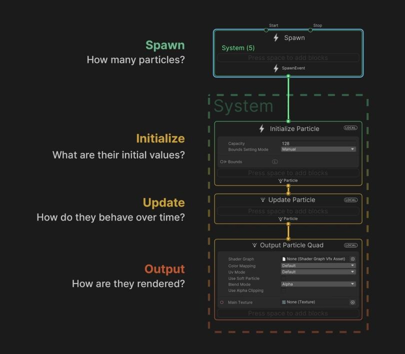
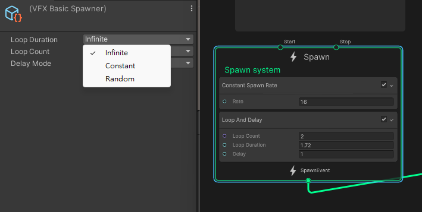
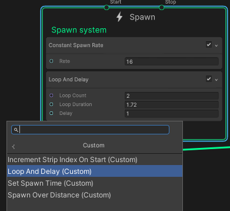
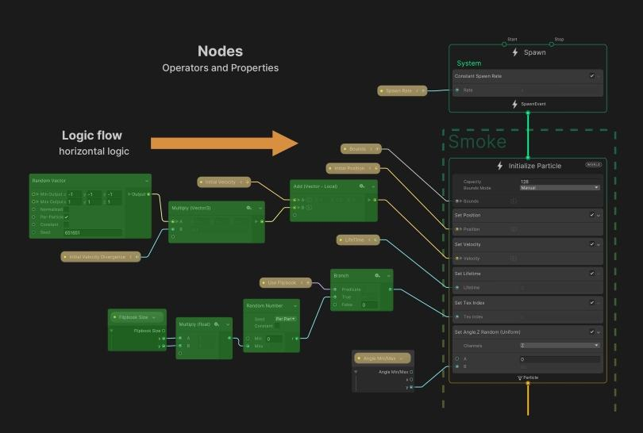
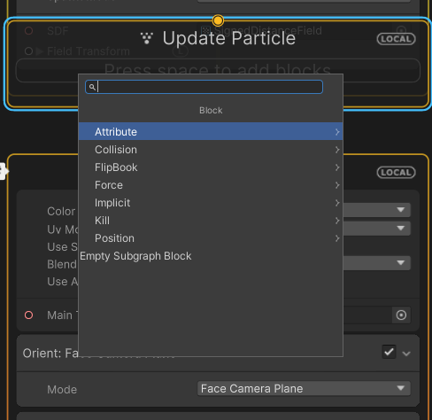

## Contexts

Contexts are the **main element of the Visual Effect Graph's processing (vertical) workflow** and **determine how particles spawn and simulate**.

Contexts connect to one another sequentially to define the lifecycle of particles. After a graph creates new particles, the Initialize Context can connect to an Update Particle Context to simulate each particle. Also, the Initialize Context can instead connect directly to an Output Particle Context to render the particles without simulating any behavior.

Contexts connect to one another sequentially to define the lifecycle of particles. After a graph creates new particles, the **Initialize** Context can connect to an **Update Particle** Context to simulate each particle. Also, the **Initialize** Context can instead connect directly to an **Output Particle** Context to render the particles without simulating any behavior.

Contexts are the parts of a System that define a stage of processing. Contexts connect together to define a system.

The four most common Contexts in a Visual Effect Graph are:

-   **Spawn**: \
    If active, Unity **calls this every Frame**, and **computes the amount of particles to spawn**. Determines how many particles you should create and when to spawn them (e.g., in one burst, looping, with a delay, etc.)
-   **Initialize**: \
    Unity **calls** this **at the "birth" of every particle**, This defines the **initial state of the particle**. Determines the starting Attributes for the particles, as well as the Capacity (maximum particle count) and Bounds (volume where the effect renders)
-   **Update**:\
    Unity **calls this every frame for all particles**, and uses this to **perform simulations**, for example **Forces and Collisions**. Changes the particle properties each frame; here you can apply Forces, add animation, create Collisions, or set up some interaction, such as with Signed Distance Fields (SDF)
-   **Output**: \
    Unity **calls this every frame for every particle**. This determines the **shape of a particle**, and **performs pre-render transformation**s. Renders the particles and determines their final look (color, texture, orientation); each System can have multiple outputs for maximum flexibility

> **Note:** Some Contexts, for example the Output Mesh, do not connect to any other Contexts as they do not relate to other systems.

Systems and Contexts form the backbone of the graph’s “vertical logic,” or processing workflow.

#### Creating and connecting Contexts
A Context is a type of graph element so to create one, see Adding graph elements.

### Event

Event Contexts only display their name, which is a string. To trigger an Event Context and activate a workflow from it, use the Event Context's name in the component API.

### Spawn

Spawn Contexts are standalone systems that have three States: Running, Idle, and Waiting.

-   **Looping** (Running): This state means that Unity computes the Blocks in the Context and spawns new particles.
-   **Finished** (Idle): This state means that the spawn machine is off and does not compute Blocks in the Context or spawn particles.
-   **DelayingBeforeLoop/DelayingAfterLoop** (Waiting): This state pauses the Context for the duration of a delay time which you can specify. After the delay, the Context resumes, computes Blocks in the Context, and spawns particles.

> To customize Spawn Contexts, you can add compatible Blocks to them.

#### Enabling and disabling
Spawn Contexts expose two flow slots: Start and Stop:

-   The **Start** input resets/starts the Spawn Context. If you do not connect anything to this flow slot, it implicitly uses the **OnPlay** Event. Using **Start** many times has the same effect as using it once.
-   The **Stop** input stops the Spawn System. If you do not connect anything to this flow slot, it implicitly uses the **OnStop** Event.

#### Looping and delaying

Each Spawn Context contains a state to determine when the Context spawns particles.

-   The Spawn Context emits particles during loops of a particular duration. This means the internal spawn time resets when each loop starts. By default, the duration is **infinite**, but you can change this.  
    To set the loop mode:
    1.  Select the Spawn Context in the graph.
    2.  In the Inspector, click the **Loop Duration** drop-down.
    3.  From the list, click either **Infinite**, **Constant**, or **Random**.
-   Spawn Contexts can perform one, many, or an infinite number of loops.  
    To set the number of loops:
    1.  Select the Spawn Context in the graph.
    2.  In the Inspector, click the **Loop** drop-down.
    3.  From the list, click either **Infinite**, **Constant**, or **Random**.
-   Spawn Contexts can perform a delay before and after each loop. During a delay, the spawn time elapses normally but the Spawn Context does not spawn any particles.  
    To set the delay duration:
    1.  Select the Spawn Context in the graph.
    2.  In the Inspector, click either the **Delay Before Loop** or **Delay After Loop** drop-down.
    3.  From the list, click either **None**, **Constant**, or **Random**.

If you set **Loop Duration**, **Loop**, **Delay Before Loop**, or **Delay After Loop** to either **Constant** or **Random**, the Spawn Context displays extra properties in its header to control each behavior. To evaluates the values you set, Unity uses the following rules:

-   If set, Unity evaluates **Loop Count** when the **Start** flow input of the Context triggers.
-   If set, Unity evaluates **Loop Duration** every time a loop starts.
-   If set, Unity evaluates **Loop Before/After Delay** every time a delay starts.

You can also create a custom loop and delay block inside the Spawn Context to custom loop or delay you want: 

### Initialize

Initialize Contexts generate new particles based on **SpawnEvent** Data, which Unity computes from Events, Spawn Contexts, or GPU Event Contexts.

For example: If a Spawn Context states that the effect should create 200 new particles, the Initialize Context processes its Blocks for all 200 new particles.

To customize **Initialize** Contexts, you can add compatible **Blocks** to them.

Initialize Contexts are the entry point of new systems. As such, they display the following information and configuration details in their header:

| Property/Setting | Description |
| --- | --- |
| **Bounds** (Property) | Controls the Bounding box of the System. |
| **Capacity** (Setting) | Controls the allocation count of the System. |

### Update

Update Contexts update all living particles in the system based on **Particle** Data, which Unity computes from Initialize and Update Contexts. Unity executes Update Contexts, and thus updates every particle, every frame.

Particle Update Contexts also automatically process some computations for particles in order to simplify common editing tasks.

To customize **Update** Contexts, you can add compatible **Blocks** to them.

| Setting | Description |
| --- | --- |
| **Update Position** | Specifies whether Unity applies velocity integration to the particles. When enabled, Unity applies simple Euler velocity integration to each particle's position every frame. When disabled, Unity does not apply any velocity integration. |
| **Update Rotation** | Specifies whether Unity applies angular integration to the particles. When enabled, Unity applies simple Euler integration to each particle's rotation every frame. When disabled, Unity does not apply any angular integration. |
| **Age Particles** | If the Context uses the Age attribute, this controls whether the Update Context makes particles age over time. |
| **Reap Particles** | If the Context uses the Age and Lifetime attributes, this control whether the Update Context removes a particles if the particle's age is greater than its lifetime. |

### Output

**Output Contexts render the particles in a system**. They render the particles with different modes and settings depending on the particle Data from the **Initialize** and **Update** Contexts in the same system. It then renders the configuration as a particular primitive shape.

To customize **Output** Contexts, you can add compatible **Blocks** to them.

## Blocks
Blocks are Nodes that **define the behavior of a Context**. \
You can **create and reorder Blocks within a Context** and, when Unity plays a visual effect, Blocks execute from top to bottom.

Blocks are Nodes that you **can stack into a Context**. Every Block is in charge of one operation. For example, it can apply a force to the velocity, collide with a sphere, or set a random color.

When you create a Block, you can reorder it within it current Context, or move it to another compatible Context.

To customize a Block, you can:

-   Adjust a property. To do this, connect a property Port to another Node with an Edge.
    
-   Adjust the settings of a property. Settings are editable values without ports that you cannot connect to other Nodes.

> You can use Blocks for many purposes, from simple value storage (for example, a random Color) to high-level complex operations such as Noise Turbulence, Forces, or Collisions.

Blocks can do just about anything, from simple value storage for Color, to complex operations such as Noises, Forces, and Collisions. They often have slots on the left, where they can receive input from Operators and Properties.

#### Adding Blocks

To add a Block to a Context, either:

-   Right click the Context and select **Create Block** from the context menu.
-   With the cursor above a Context, press the spacebar.

**Note**: Unity places the Block that you create at the closest position to the cursor. Use this behavior to place Blocks in the correct position.

https://docs.unity3d.com/Packages/com.unity.visualeffectgraph@17.0/manual/Blocks.html

### Particle Trails

Particle trails are a common effect used in games to create the illusion of movement.

They are often used for things like rockets, bullets, and other fast-moving objects.

To create a particle trail effect in VFX Graph, you can use the Trail Renderer node.

Here's how:

↪In the VFX Graph editor, right-click in the graph view and select **Create Node > Renderer > Trail Renderer**.

↪Connect the Trail Renderer node to the Spawn node by dragging a connection from the Spawn node's output port to the Trail Renderer node's input port.

↪In the Trail Renderer node, set the Trail Length parameter to 1 and adjust other parameters to your liking.

↪Save the VFX Graph asset and play the scene.

### Particle Collisions

Particle collisions can add a sense of realism to particle systems by creating interactions between particles and other objects in the scene.

To create a particle collision effect in VFX Graph, you can use the Collision node.

Here's how:

↪In the VFX Graph editor, right-click in the graph view and select **Create Node > Context > Collision**.

↪Connect the Collision node to the Spawn node by dragging a connection from the Spawn node's output port to the Collision node's input port.

↪In the Collision node, adjust the Collision Type and other parameters to your liking.

↪Save the VFX Graph asset and play the scene.

### Particle Textures

Using textures in particle systems can create more interesting and detailed effects.

To use textures in VFX Graph, you can use the Texture Sheet Animation node.

Here's how:

↪In the VFX Graph editor, right-click in the graph view and select **Create Node > Texture > Texture Sheet Animation**.

↪Connect the Texture Sheet Animation node to the Spawn node by dragging a connection from the Spawn node's output port to the Texture Sheet Animation node's input port.

↪In the Texture Sheet Animation node, select a texture sheet and adjust other parameters to your liking.

↪Save the VFX Graph asset and play the scene.

### Particle Forces

Using forces in particle systems can create more dynamic and realistic effects.

To apply forces to particles in VFX Graph, you can use the Force Field node.

Here's how:

↪In the VFX Graph editor, right-click in the graph view and select **Create Node > Context > Force Field**.

↪Connect the Force Field node to the Spawn node by dragging a connection from the Spawn node's output port to the Force Field node's input port.

↪In the Force Field node, adjust the Force Type, Force Strength, and other parameters to your liking.

↪Save the VFX Graph asset and play the scene.

### Custom Shaders

To create truly unique and customized particle effects, you can use custom shaders in your VFX Graph.

You can create a custom shader that defines how particles are rendered and then use it in your VFX Graph to create the desired effect.

Here's how:

↪Create a new shader asset by right-clicking in the Project window and selecting **Create > Shader**.

↪Write a custom shader using ShaderLab syntax that defines how particles are rendered.

↪In the VFX Graph editor, right-click in the graph view and select **Create Node > Renderer > Custom**.

↪Connect the Custom node to the Spawn node by dragging a connection from the Spawn node's output port to the Custom node's input port.

↪In the Custom node, select the custom shader asset you created earlier.

↪Save the VFX Graph asset and play the scene.

### Audio Reactivity

You can use audio reactivity in your particle systems to create effects that respond dynamically to the game's sound effects and music.

To create an audio-reactive particle system in VFX Graph, you can use the Audio Spectrum node.

Here's how:

↪In the VFX Graph editor, right-click in the graph view and select **Create Node > Context > Audio Spectrum**.

↪Connect the Audio Spectrum node to the Spawn node by dragging a connection from the Spawn node's output port to the Audio Spectrum node's input port.

↪In the Audio Spectrum node, adjust the parameters to your liking.

↪Save the VFX Graph asset and play the scene with audio.

> When you select Context or Block in the VFX graph workspace, inspector may show its setting related to it.

### ref 
https://docs.unity3d.com/Packages/com.unity.visualeffectgraph@17.0/manual/Contexts.html

