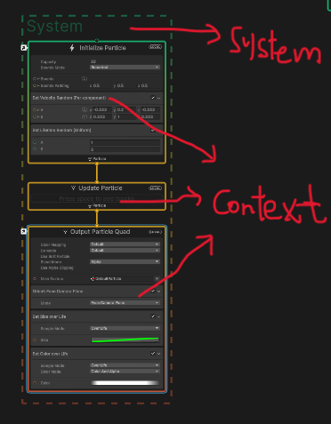
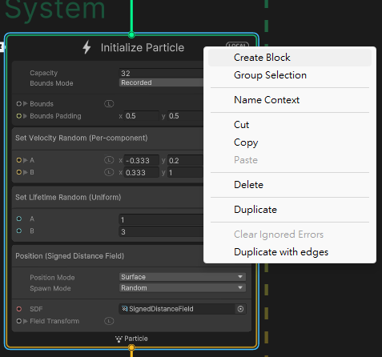
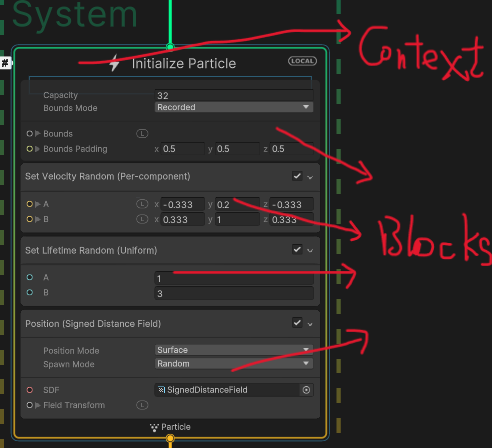

## Contexts

Contexts are the **main element of the Visual Effect Graph's processing (vertical) workflow** and determine how particles spawn and simulate.

Contexts connect to one another sequentially to define the lifecycle of particles. After a graph creates new particles, the Initialize Context can connect to an Update Particle Context to simulate each particle. Also, the Initialize Context can instead connect directly to an Output Particle Context to render the particles without simulating any behavior.

Contexts connect to one another sequentially to define the lifecycle of particles. After a graph creates new particles, the **Initialize** Context can connect to an **Update Particle** Context to simulate each particle. Also, the **Initialize** Context can instead connect directly to an **Output Particle** Context to render the particles without simulating any behavior.

#### Creating and connecting Contexts
A Context is a type of graph element so to create one, see Adding graph elements.

### Event

Event Contexts only display their name, which is a string. To trigger an Event Context and activate a workflow from it, use the Event Context's name in the component API.

### Spawn

Spawn Contexts are standalone systems that have three States: Running, Idle, and Waiting.

-   **Looping** (Running): This state means that Unity computes the Blocks in the Context and spawns new particles.
-   **Finished** (Idle): This state means that the spawn machine is off and does not compute Blocks in the Context or spawn particles.
-   **DelayingBeforeLoop/DelayingAfterLoop** (Waiting): This state pauses the Context for the duration of a delay time which you can specify. After the delay, the Context resumes, computes Blocks in the Context, and spawns particles.

  
### Initialize

Initialize Contexts generate new particles based on **SpawnEvent** Data, which Unity computes from Events, Spawn Contexts, or GPU Event Contexts.

For example: If a Spawn Context states that the effect should create 200 new particles, the Initialize Context processes its Blocks for all 200 new particles.

To customize **Initialize** Contexts, you can add compatible **Blocks** to them.

Initialize Contexts are the entry point of new systems. As such, they display the following information and configuration details in their header:

| Property/Setting | Description |
| --- | --- |
| **Bounds** (Property) | Controls the Bounding box of the System. |
| **Capacity** (Setting) | Controls the allocation count of the System. |

### Update

Update Contexts update all living particles in the system based on **Particle** Data, which Unity computes from Initialize and Update Contexts. Unity executes Update Contexts, and thus updates every particle, every frame.

Particle Update Contexts also automatically process some computations for particles in order to simplify common editing tasks.

To customize **Update** Contexts, you can add compatible **Blocks** to them.

| Setting | Description |
| --- | --- |
| **Update Position** | Specifies whether Unity applies velocity integration to the particles. When enabled, Unity applies simple Euler velocity integration to each particle's position every frame. When disabled, Unity does not apply any velocity integration. |
| **Update Rotation** | Specifies whether Unity applies angular integration to the particles. When enabled, Unity applies simple Euler integration to each particle's rotation every frame. When disabled, Unity does not apply any angular integration. |
| **Age Particles** | If the Context uses the Age attribute, this controls whether the Update Context makes particles age over time. |
| **Reap Particles** | If the Context uses the Age and Lifetime attributes, this control whether the Update Context removes a particles if the particle's age is greater than its lifetime. |

### Output

Output Contexts render the particles in a system. They render the particles with different modes and settings depending on the particle Data from the **Initialize** and **Update** Contexts in the same system. It then renders the configuration as a particular primitive shape.

To customize **Output** Contexts, you can add compatible **Blocks** to them.

### Blocks
Blocks are Nodes that **define the behavior of a Context**. \
You can **create and reorder Blocks within a Context** and, when Unity plays a visual effect, Blocks execute from top to bottom.

> You can use Blocks for many purposes, from simple value storage (for example, a random Color) to high-level complex operations such as Noise Turbulence, Forces, or Collisions.

#### Adding Blocks

To add a Block to a Context, either:

-   Right click the Context and select **Create Block** from the context menu.
-   With the cursor above a Context, press the spacebar.

**Note**: Unity places the Block that you create at the closest position to the cursor. Use this behavior to place Blocks in the correct position.

https://docs.unity3d.com/Packages/com.unity.visualeffectgraph@17.0/manual/Blocks.html

### ref 
https://docs.unity3d.com/Packages/com.unity.visualeffectgraph@17.0/manual/Contexts.html

