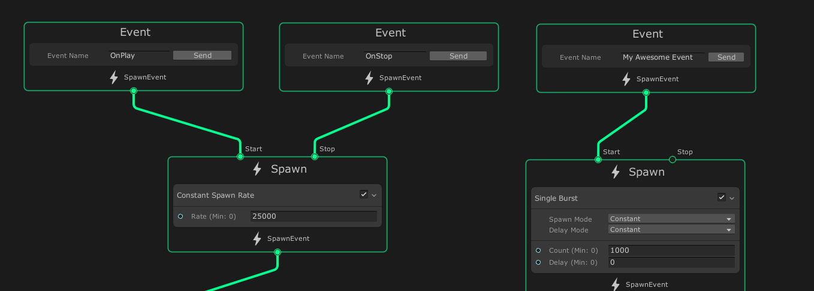
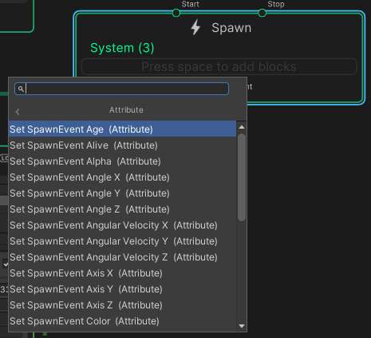
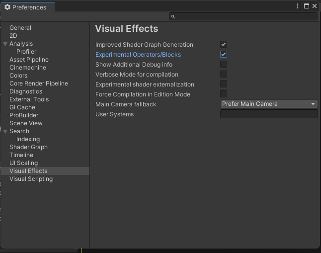
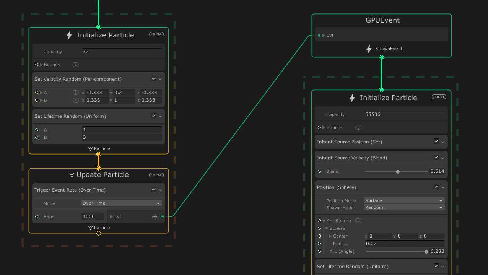

## Events

Events **define the inputs** for a **Visual Effect Graph's processing workflow**. 

The **Spawn** and **Initialize Contexts** use **Events as their inputs**. 

An Event Context identifies an Event by its **Event string name or ID** inside a graph. 

Through Events, a Visual Effect Graph can :

- **Start** and **stop spawning particles**.
- **Read Event Attribute payloads sent from C# scripts**.

In general, an Event is just a string that represents the Event's name. To receive an Event in the Visual Effect Graph, create an Event Context and type the name of the Event you want to receive in the Event Name property. 

> **Note**: Event Contexts have **no input flow slots** and can **only connect their output flow slot** to **Spawn** or **Initialize Contexts**.

When something needs to happen, **external GameObjects can notify parts of your graph** with the **`SendEvent`** method of the **C# API**. Visual Effect components will **then pass the Event as a string name or property ID**. An Event Context identifies an Event by its Event string name or ID inside a graph.

To **create an Event Context**:

- In the Visual Effect Graph window, **right-click in an empty space**.
From the menu, click Create Node.
- In the Node Creation menu, click **Contexts > Event (Context**).
- In the Event Name input field, **type the name of your Event**.

### Default Events

The Visual Effect Graph provide two default Events:

-   **OnPlay**: To enable the spawning of particles. If you do not assign an Event to a Spawn Context's **Start** input flow slot, the Visual Effect Graph implicitly binds this Event to that input flow slot instead.
-   **OnStop**: To disable the spawning of particles. If you do not assign an Event to a Spawn Context's **Stop** input flow slot, the Visual Effect Graph implicitly binds this Event to that input flow slot instead.

If you connect an Event Context to a Spawn Context's **Start** or **Stop** input flow slot, this removes the implicit binding to the **OnPlay** and **OnStop** Events respectively.

### Custom Events
If you do not want to use the default Events, you can **use an Event Context to create your own custom Event**.

To do this, first **create an Event Context**, then **type the name of your custom Event** in the **Event Name property**.

### Event Attribute Payloads

**Event Attribute payloads** are **attributes** that you **can attach to an Event**. \
To **set these attributes** in a **Visual Effect Graph**, you can use the **Set [Attribute]** **Blocks** in **Spawn Contexts**, \
. \
but you can also **attach them to Events you send from C# scripts**. For information on how to do that latter, see **Component API** .

> **Event Attribute Payloads are attributes that implicitly travel through the graph from Events**, through **Spawn Contexts**, and **eventually to** an **Initialize Context**. 

> To **catch a payload** in an **Initialize Context**, use **`Get Source Attribute`** Operators or **`Inherit [Attribute]`** Blocks.

### GPU Events
**GPU Events** are an Experimental feature of the Visual Effect Graph. They **allow you to spawn particles based on other particles**. \
To **enable this option**, **enable the Experimental Operators/Blocks checkbox in the Visual Effect Preferences** .

GPU Events are **Event Contexts that rely on data sent from other systems**, for example, when a particle dies. The following Update Blocks can send GPU Event Data:

-   **Trigger Event On Die**: **Spawns N Particles on another system** **when a particle dies**.
-   **Trigger Event Rate**: Spawn N Particles per second (or per distance travelled), based on a particle from a system.
-   **Trigger Event Always**: Spawns N Particles every frame.

> These Blocks connect to a **GPUEvent** Context. This Context does not handle any Blocks, but instead connects to an **Initialize Context of a child system**.

To gather data from the parent particle, a child system must refer to Source Attributes in its Initialize Context. To do this, a child system can use a **Get Source Attribute** Operator, or an **Inherit Attribute** Block. For a visual example, see the image below.

### Output Events
You can combine an Output Event with an **`Output Event Handler`**. **Output Events are useful if the initial spawning of the particles needs to drive something else in your scene**. This is common for **synchronizing lighting or gameplay** with your visual effects.

The above example sends an **OnReceivedEvent** to a GameObject component outside of the graph. The C# script will then react accordingly to intensify a light or flame, activate a spark, etc.

> At the same time, you can use **GPU Events** to spawn particles based on other particle behavior. This way, when a particle dies in one system, you can notify another system, which creates a useful chain reaction of effects, such as a projectile particle that spawns a dust effect upon death.

#### Output Event Handlers

A **`VFXOutputEventAbstractHandler` is an API helper** that hooks into an **Output Event** to allow you to **execute scripts based on the event**.

https://docs.unity3d.com/Packages/com.unity.visualeffectgraph@12.1/manual/OutputEventHandlers.html \
https://unity.com/how-to/introduction-vfx-graph-unity#output-events

### ref 
https://docs.unity3d.com/Packages/com.unity.visualeffectgraph@17.0/manual/Events.html

