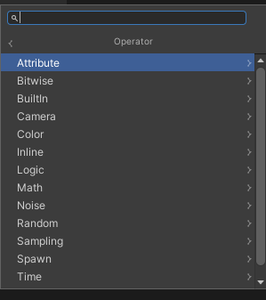

## Operators

Operators are Nodes that **compose the low-level operations of the property workflow**, **such as Math, Time, Logic, Attribute, etc**.

You can connect Nodes together to generate custom behaviors.

Node networks connect to Ports that belong to Blocks or Contexts.

This Nodes allow you to define custom expressions in Visual Effect Graphs that you can use to create custom behaviors. For instance compute values from math operations and use the result of these operations to sample curves, gradients, to use the resulting values into Block or Context input Properties.

### Adding Operator Nodes

You can add Operator Nodes in the followings ways:

-   In the Create Node Menu:
    -   Right-click in an empty space and select **Create Node** from the menu.
    -   Right-click on a edge and selecting **Create Node** from the menu.
    -   Press the Spacebar key when the cursor is in an empty space.
    -   Drag an Edge Connection from a Property, then release in an empty space.
-   Duplicate Nodes:
    -   Select **Duplicate** in the Context menu (or Ctrl+D).
    -   **Copy**, **Cut** and **Paste** the Operator from Context menu (or Ctrl+C/Ctrl+X then Ctrl+V).

### ref 
https://docs.unity3d.com/Packages/com.unity.visualeffectgraph@17.0/manual/Operators.html

