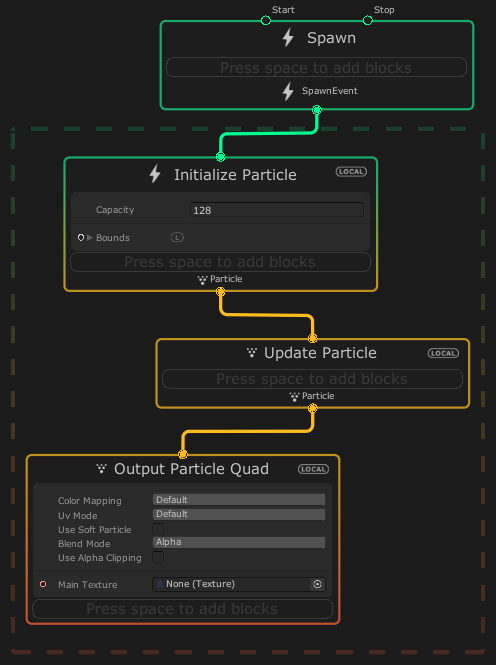

## Systems

A System **refers to one or many Contexts that define a standalone part of a visual effect**. \
A System can be a Particle System, a Particle Strip System, a Mesh, or a Spawn machine. In the graph view, a System draws a dashed line box around the Contexts that it consists of.

A VFX Graph includes one or more vertical stacks called **Systems**. Systems define standalone portions of the graph and encompass several **Contexts**. A **System is denoted by the dotted line that frames the Contexts it consists of**.

**Each Context is composed of individual Blocks**, which can **set Attributes (size, color, velocity, etc.) for its particles and meshes**. **Multiple Systems can work together within one graph to create the final visual effect**.

> Find **prebuilt templates** under the **Create Node > Systems** menu to view some examples of graph logic.

### Creating System from templates

The Visual Effect Graph comes with pre-built System templates that you can add to your graph. To create a System from a template:

1.  Right Click in an empty space of your workspace and select **Create Node**.
2.  In The menu, select **System**.
3.  Select a template from the list.

### System simulation spaces

Some Systems use a simulation space property to define the reference space that it uses to simulate its contents:

- **Local space** Systems **simulate the effect locally to the GameObject** that holds the Visual Effect component.
- **World space** Systems **simulate the effect independently of the GameObject** that holds the Visual Effect component.

> To change the simulation space for a System, click the System's simulation space identifier to cycle through the compatible spaces.

### ref
https://docs.unity3d.com/Packages/com.unity.visualeffectgraph@16.0/manual/Systems.html
