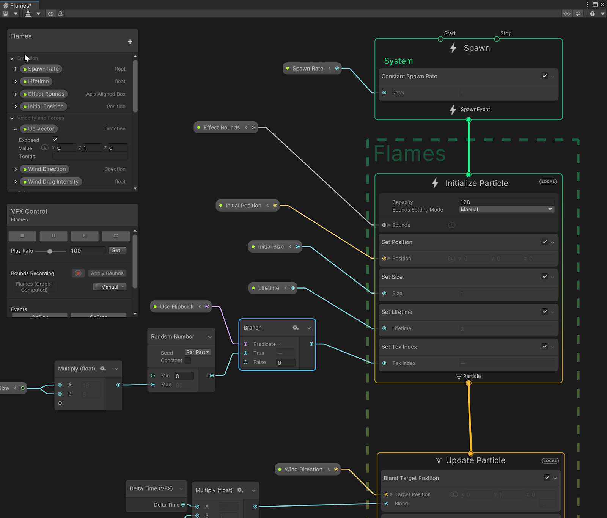

## Visual Effect Graph

The Visual Effect Graph is a package that you can use to **create large-scale visual effects** for your Unity Project. 

> **Note**: The **Visual Effect Graph simulates particle behavior on the GPU**, which allows it to **simulate many more particles than the Built-in Particle System**.

If you want to **create visual effects that include a large number of particles** and need highly customisable behavior, use the **Visual Effect Graph** instead of the Built-in Particle System.

This visual node-based solution enables you to design visual effects, from simple common particle behaviors to complex simulations running on the GPU.

Available for PC, consoles, XR and high-end mobile, VFX Graph has been used in games such as [_V Rising_](https://www.youtube.com/watch?v=C7KTI94LzI8), [_Road 96_](https://www.youtube.com/watch?v=W5ZfH-fbqIQ), [_Hardspace: Shipbreaker_](https://www.youtube.com/watch?v=VWjn3MQHWC8), and _[Syberia: The World Before](https://www.youtube.com/watch?v=L4CIrBygieg)_

### VFX
The **VFX tab** in the **Project Settings** window controls settings **relevant to the Visual Effect Graph**.

This tab is **only visible if you install the Visual Effect Graph package**. For information on how to install the Visual Effect Graph

**Use a Visual Effect Graph to:**

- Create one or multiple Particle Systems.
- Add static meshes and control Shader properties.
- Create properties to customize the instances you use in the Scene.
- Create events to turn parts of your effect on and off. You can then send these events from the Scene via C# or Timeline.
- Extend the library of features by creating sub-graphs of the Nodes that you commonly use.
- Use a Visual Effect Graph in another Visual Effect Graph. For example, you can reuse and customize a simple but configurable explosion in more complex graphs.
- Previews changes immediately, so you can simulate effects at various rates and perform step-by-step simulation. For instructions on how to install the Visual Effect Graph, see Getting started with Visual Effect Graph.

### Visual Effect Graph Assets

A Visual Effect Graph Asset is a **data container** that the Visual Effect Graph uses the play a visual effect. It includes:

-   Graph elements
-   Exposed properties
-   Compiled Shaders
-   Operator bytecode

#### Visual Effect Asset Inspector
| Property Name | Description / Values |
| --- | --- |
| **Fixed Delta Time** | Indicates whether to update the visual effect at the rate that the **Fixed Time Step** property defines in the Visual Effect Project Settings|
| **Culling Flags** | Sets whether Unity updates the visual effect depending on its culling state. The culling state refers to whether a Camera can see the visual effect's bounding box or not. The options are: • **Recompute bounds and simulate when visible**: Unity simulates the effect and recalculates the effect's bounding box when the effect is visible. If your visual effect uses a dynamic bounding box (one that you compute with Operators), do not use this option and instead use one that includes **Always Recompute Bounds** . • **Always Recompute Bounds, simulate only when Visible**: Regardless of whether any Camera can see the effect's bounding box or not, Unity always recalculates the bounding box. Unity only simulates the effect if a Camera can see the updated bounds. • **Always Recompute Bounds and Simulate**: Regardless of whether any Camera can see the effect's bounding box or not, Unity always recalculates the bounding box and simulates the effect. **Note**: Regardless of the mode, Unity always uses the bounding box to perform culling of the effect. |
| **Exact Fixed Time** | Indicates whether to update the visual effect multiple times per frame if the frame time is longer than the **Fixed Time Step**. For example, if a frame takes 10ms and **Fixed Time Step** is 5 ms, the effect updates twice with a 5ms deltaTime instead of once with a 10ms deltaTime. This is a resource intensive operation so only use it in high-end scenarios. This property is only relevant if you enable **Fixed Delta Time**. |
| **Ignore Time Scale** | Indicates whether to ignore the timeScale when Unity simulates the effect. Enable this property if you want the visual effect to play at normal speed when the time scale is not equal to `1`. |
| **PreWarm Total Time** | Sets the duration, in seconds, that Unity simulates the effect for when `Reset()` occurs. This pre-simulates the effect so that, when the effect starts, it appears already 'built-up'. When you change this value, Unity calculates a new value for **PreWarm Delta Time**. |
| **PreWarm Step Count** | Sets the number of simulation steps that Unity uses to calculate the PreWarm. A greater number of steps increase precision as well as the resource intensity of the effect, which decreases performance. When you change this value, Unity calculates a new value for **PreWarm Delta Time**. |
| **PreWarm Delta Time** | Sets the delta time, in seconds, that Unity uses for the PreWarm. When you change this value, Unity calculates new values for **PreWarm Total Time** and **PreWarm Step Count**. Adjust this value, instead of **PreWarm Total Time** and **PreWarm Step Count** individually, if you need to use a precise delta time for your simulation. |
| **Initial Event Name** | Sets the name of the Event that Unity sends when the effect enables. The default value is **OnPlay**, but you can change this to another name, or even a blank field, to make it so that every system does not spawn by default. |
| **Output Render Order** | Defines a list that shows every Output Context in their rendering order. You can re-order this list to change the order that Unity renders the Output Contexts. Unity draws items at the top of the list first then progressively draws those lower down the list in front of those above. |
| **Shaders** | Defines a list of every Shader that Unity has compiled for the Visual Effect Graph. These are read-only and mainly for debugging purposes. Use **Shader Externalization** in Visual Effect Preferences to externalize Shaders temporarily for debugging purposes. |

https://docs.unity3d.com/Packages/com.unity.visualeffectgraph@17.0/manual/VisualEffectGraphAsset.html

### Using a Visual Effect Graph
Visual Effect Graph is a Unity package that uses a Scriptable Render Pipeline to render visual effects. Visual Effect graph uses on compute Shaders to simulate effects.

#### Installing Visual Effect Graph:

1. Open a Unity project. 2. Open the **Package Manager** window (**Window > Package Manager**). 3. In the **Package Manager** window, in the **Packages** field, select **Unity Registry**.4. Select **Visual Effect Graph** from the list of packages. 5. In the bottom right corner of the Package Manager window, select **Install**. Unity installs Visual Effect Graph into your Project.

#### Creating Visual Effect Graphs:

To use Visual Effect Graph, you **must first create a Visual Effect Graph Asset**.

**To create a Visual Effect Graph Asset:**

 - In Unity, click **Assets > Create > Visual Effects > Visual Effect Graph**.

**To make a copy of a Visual Effect Graph Asset:**

- In the Project window, select the Visual Effect Asset you want to make a copy of.
- In the top navigation bar, select **Edit > Duplicate**. You’ve now created a copy.

#### Using Visual Effect Graphs in Scenes

To use a **Visual Effect Graph**, you **must add a Visual Effect** to the Scene.

To do so, you can:

-   **Drag and drop a Visual Effect Graph Asset** from the Project Window into the Hierarchy Window. \
    When you **drop the Asset on an existing GameObject**, this **adds a new child GameObject with a Visual Effect Component**, and **assigns the graph to it**. \
    When you **drop the Asset on an empty space**, Unity **creates a new Visual Effect GameObject** and **assigns the graph to it**.
-   **Drag and drop a Visual Effect Graph Asset** from the Project Window to the Scene View Window. This **makes the graph appear in front of the Camera**.

> When you’ve **added the Visual Effect Graph Asset to Hierarchy**, Unity **attaches the Asset to a Visual Effect Component**, which **references the Asset**.

#### Editing a Visual Effect Graph

To edit **Visual Effect Graph Assets** in the **Visual Effect Graph window**:

-   Open the **Visual Effect Graph window** (menu: **Window** > **Visual Effects**) with an empty graph. This prompts you to **open a Visual Effect Graph Asset**.
-   **Select an existing Visual Effect Graph Asset**, and click the **Edit** button in the **Inspector**. This **opens the Visual Effect Graph window with the graph contained in this Asset**.
-   Select the **Visual Effect component** (menu: next to the Asset template, click **Edit**). This opens the Visual Effect Graph window and with the graph contained in the **referenced Asset**.

#### Previewing a graph’s effect

To **preview an effect**, you can:

-   Select a **Visual Effect Graph Asset** and **use the Inspector Preview window**.
    
-   **Place your effect directly in the Scene** as a **Visual Effect GameObject**.

> This lets you edit parameters directly in the Scene, see the lighting on your effect, and use the Target GameObject Panel features for the specific target instance of your effect.

### Unity Visual Effect Graph - Samples
https://github.com/Unity-Technologies/VisualEffectGraph-Samples

### ref

https://unity.com/how-to/introduction-vfx-graph-unity

https://docs.unity3d.com/Packages/com.unity.visualeffectgraph@17.0/manual/index.html

**The Visual Effect Graph window** \
https://docs.unity3d.com/Packages/com.unity.visualeffectgraph@17.0/manual/VisualEffectGraphWindow.html

https://unity.com/visual-effect-graph

**Node library:** \
https://docs.unity3d.com/Packages/com.unity.visualeffectgraph@17.0/manual/node-library.html

https://www.youtube.com/watch?v=LhvnIOlmXMM 

https://www.youtube.com/watch?v=h4SBACYb26k

https://glarity.app/zh-TW/videosummary/education/unity-vfx-graph-spawn-effect-tutorial-16577475_1748925

https://medium.com/akatsuki-taiwan-technology/unity-visual-effect-graph%E5%BF%AB%E9%80%9F%E4%B8%8A%E6%89%8B%E6%8C%87%E5%8D%97-a1906346ed30

### Scripting API
https://docs.unity3d.com/Packages/com.unity.visualeffectgraph@16.0/api/index.html

