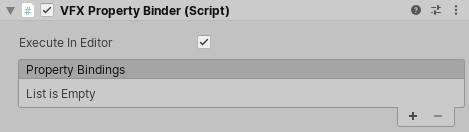
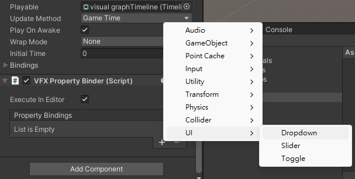

## VFX Property Binders
Property Binders are C# Behaviors you can **attach to a GameObject that has a Visual Effect Component**. Use these behaviors to **make connections between scene or gameplay values and Exposed Properties** for this **Visual Effect instance**.

For example, a Sphere Binder can automatically set the position and the radius of a Sphere Exposed Property using the values of a sphere collider that is linked in the scene.

**Adding Property Binders**: 

You can add Property Binders through a common MonoBehaviour called VFX Property Binder. This behavior allows you to use one or more **Property Bindings**. Each property binding is creates a relationship between an **Exposed Property** and a runtime or scene element.

You can also add Property binders through the **Add Component** menu. Unity creates a VFX Property Binder component automatically if one does not already exist.

### Built-in Property Binders

The Visual Effect Graph package comes with the following built-in property binders:
​
-   Audio
    -   **Audio Spectrum to AttributeMap :** Bakes the Audio Spectrum to an Attribute map and binds it to a Texture2D and uint Count properties.
-   GameObject:
    -   **Enabled** : Binds the Enabled flag of a Game Object to a bool property.
-   Point Cache:
    -   **Hierarchy to AttributeMap** : Binds positions an target positions of a hierarchy of transforms to Texture2Ds AttributeMaps and uint Count.
    -   **Multiple Position Binder**: Binds positions of a list of transforms to a Texture2D AttributeMap and uint Count.
-   Input:
    -   **Axis** : Binds the float value of an Input Axis to a float property.
    -   **Button** : Binds the bool value of a button press state to a bool property.
    -   **Key** : Binds the bool value of a keyboard key press state to a bool property.
    -   **Mouse** : Binds the general values of a mouse (Position, Velocity, Clicks) to exposed properties.
    -   **Touch** : Binds a input values of a Touch Input (Position, Velocity) to exposed properties.
-   Utility:
    -   **Light** : Binds Light Properties (Color, Brightness, Radius) to exposed properties.
    -   **Plane** : Binds Plane Properties (Position, Normal) to exposed properties.
    -   **Terrain** : Binds Terrain Properties (Size, Height Map) to exposed properties.
-   Transform:
    -   **Position**: Binds game object position to vector exposed property.
    -   **Position (previous)**: Binds previous game object position to vector exposed property.
    -   **Transform**: Binds game object transform to transform exposed property.
    -   **Velocity**: Binds game object velocity to vector exposed property.
-   Physics:
    -   **Raycast**: Performs a Physics Raycast and binds its result values (hasHit, Position, Normal) to exposed properties..
-   Collider:
    -   **Sphere**: Binds properties of a Sphere Collider to a Sphere exposed property.
-   UI:
    -   **Dropdown**: Binds the index of a Dropdown to a uint exposed property.
    -   **Slider**: Binds the value of a float slider to a uint exposed property.
    -   **Toggle**: Binds the bool value of a toggle to a bool exposed property.
Downlo

### ref
https://docs.unity3d.com/Packages/com.unity.visualeffectgraph@17.0/manual/PropertyBinders.html

